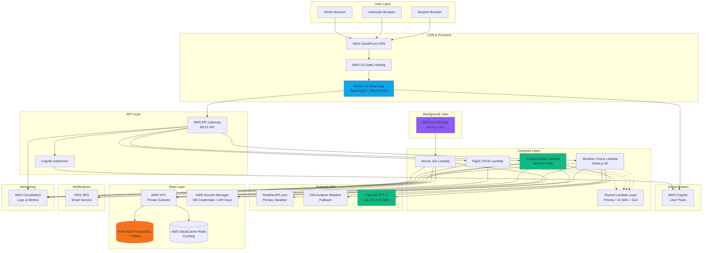
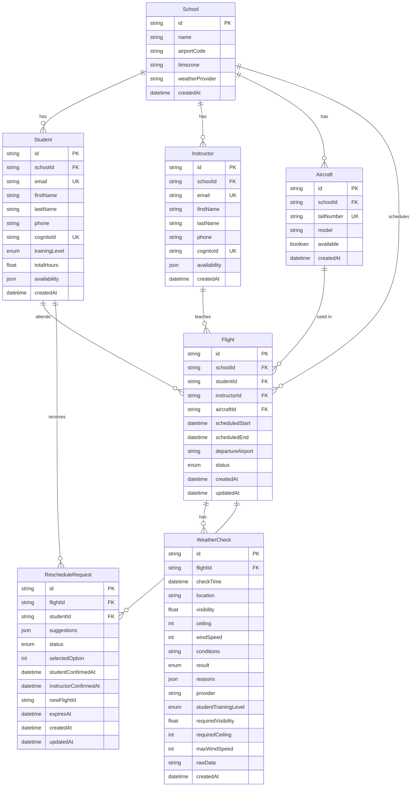
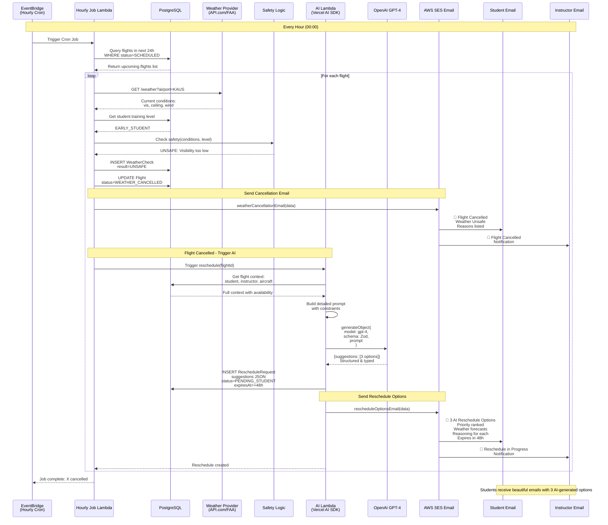
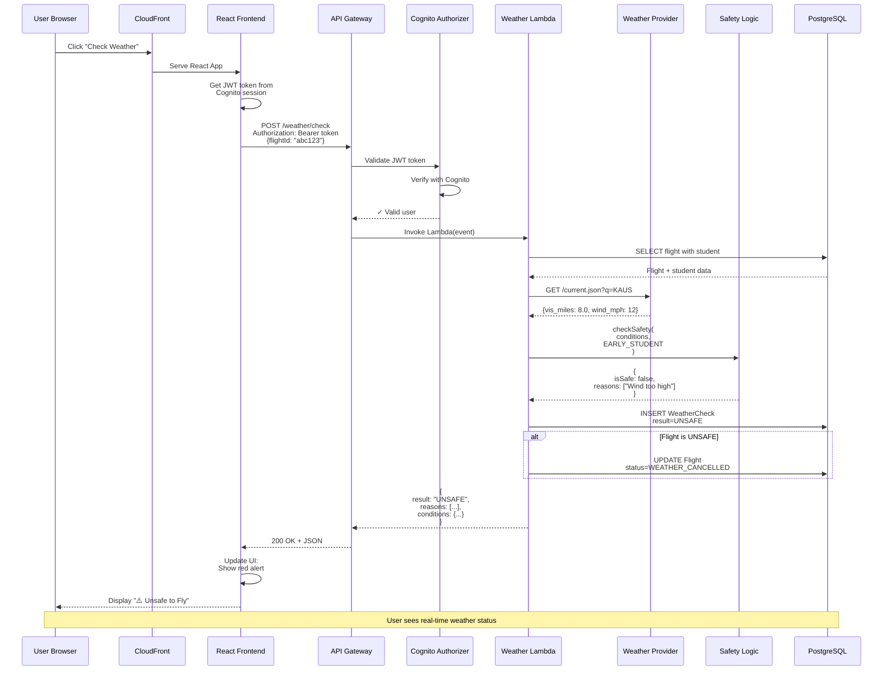
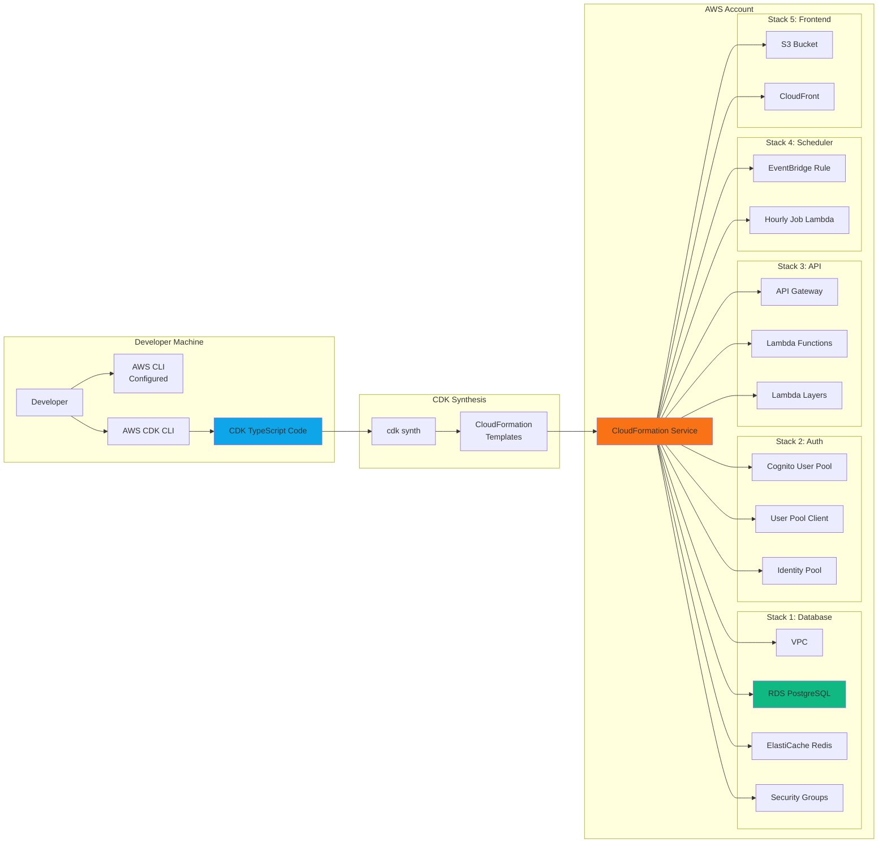
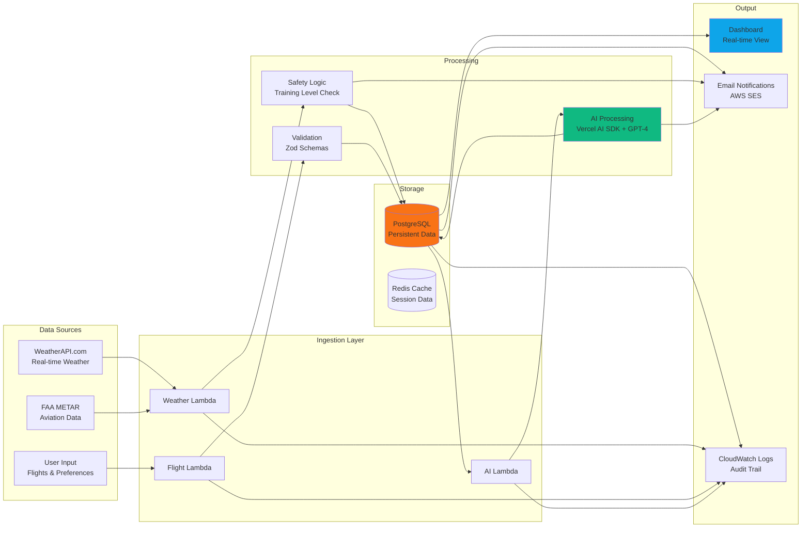
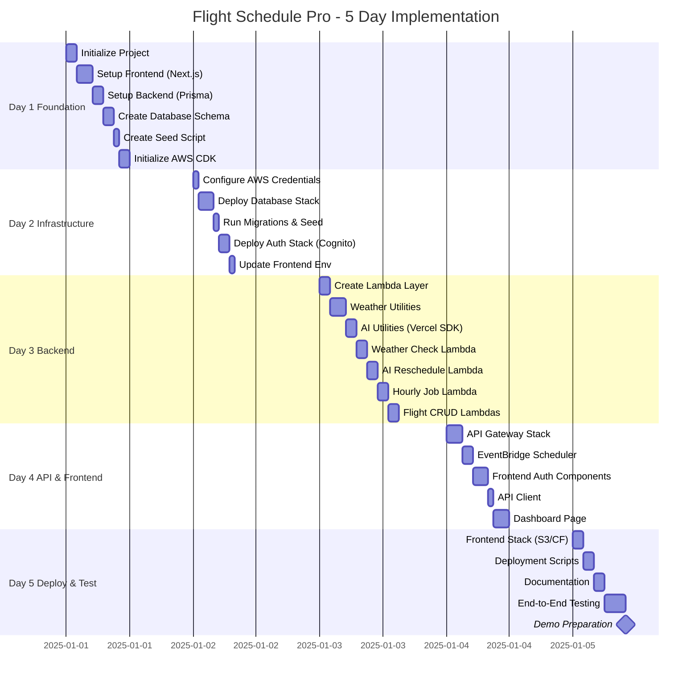
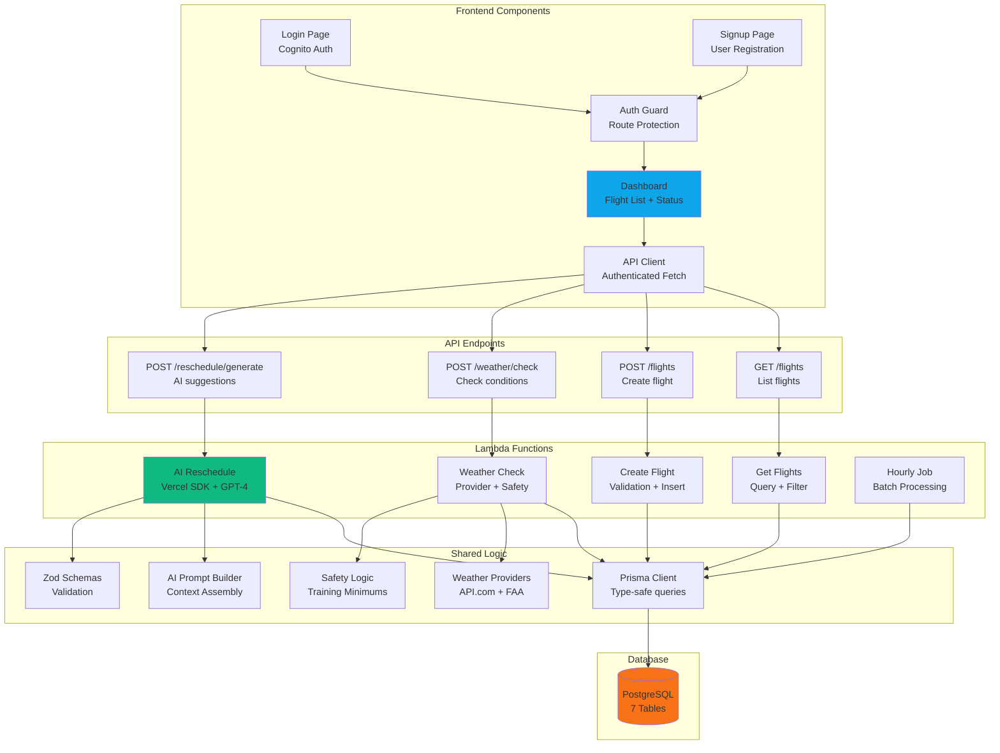
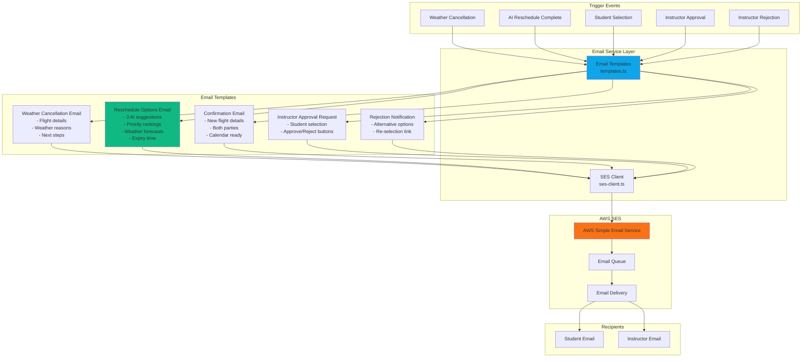
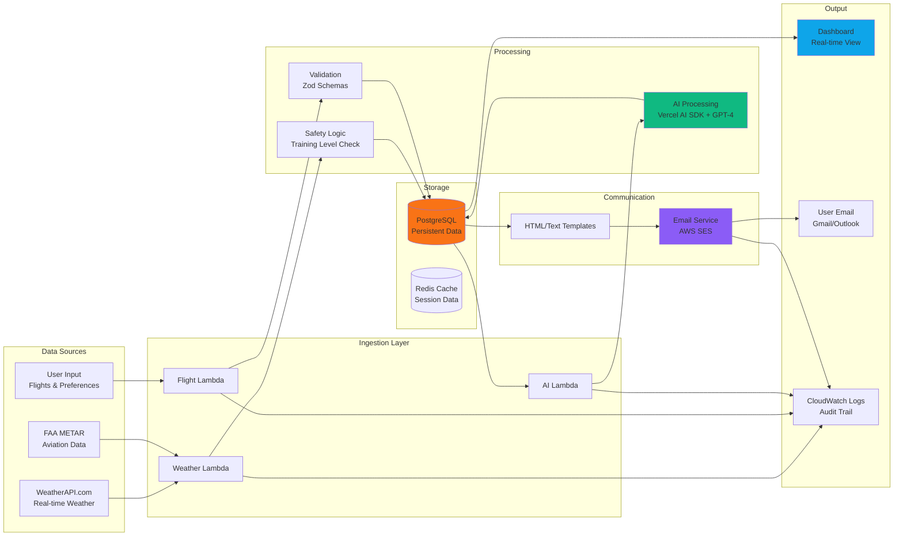

# Flight Schedule Pro - Architecture Diagrams

## 1. High-Level System Architecture



---

## 2. Database Schema Diagram



---

## 3. Weather Cancellation & AI Reschedule Workflow (COMPLETE)



---

## 4. Manual Weather Check Flow



---

## 5. Complete Reschedule Selection & Confirmation Flow

```mermaid
sequenceDiagram
    participant STU as Student Browser
    participant FE as React Frontend
    participant APIG as API Gateway
    participant SEL as Select Lambda
    participant APP as Approve Lambda
    participant DB as PostgreSQL
    participant SES as AWS SES
    participant INS as Instructor Email
    participantSTU_EMAIL as Student Email

    Note over STU,STU_EMAIL: Student receives email with 3 AI options

    STU->>FE: Login to dashboard
    FE->>APIG: GET /reschedule/requests?studentId=xyz
    APIG->>SEL: Fetch pending requests
    SEL->>DB: SELECT from RescheduleRequest<br/>WHERE status=PENDING_STUDENT
    DB-->>SEL: Request with 3 suggestions
    SEL-->>FE: Return requests + suggestions
    
    FE-->>STU: Display 3 time slot options:<br/>━━━━━━━━━━━━━━━━━━━━━<br/>Option 1: Tomorrow 2pm (Priority 1) ⭐<br/>  High Confidence • Good Weather<br/>  "Best availability match"<br/><br/>Option 2: Wed 10am (Priority 2)<br/>  Medium Confidence • Fair Weather<br/>  "Alternative time slot"<br/><br/>Option 3: Thu 3pm (Priority 3)<br/>  Medium Confidence • Good Weather<br/>  "Backup option"<br/>━━━━━━━━━━━━━━━━━━━━━
    
    STU->>FE: Click "Select Option 1"
    
    FE->>APIG: POST /reschedule/select<br/>{<br/>  requestId: "abc",<br/>  selectedOption: 0<br/>}
    
    APIG->>SEL: Process selection
    
    SEL->>DB: BEGIN TRANSACTION
    SEL->>DB: UPDATE RescheduleRequest<br/>SET selectedOption=0,<br/>status=PENDING_INSTRUCTOR,<br/>studentConfirmedAt=NOW()
    
    SEL->>SES: 📧 Email instructor:<br/>"Student ${name} selected Tomorrow 2pm"<br/>[Approve Button] [Reject Button]
    SES->>INS: Instructor receives email
    
    SEL->>DB: COMMIT TRANSACTION
    
    SEL-->>FE: {status: "Pending instructor approval"}
    
    FE-->>STU: ✓ "Selection sent to instructor!<br/>⏳ Waiting for approval..."
    
    Note over INS: Instructor receives email<br/>with selection details
    
    INS->>INS: Reviews time slot<br/>Clicks [Approve] button
    
    INS->>APIG: POST /reschedule/approve<br/>{<br/>  requestId: "abc",<br/>  approved: true<br/>}
    
    APIG->>APP: Process approval
    
    APP->>DB: BEGIN TRANSACTION
    
    APP->>DB: Get original flight details
    DB-->>APP: Flight + duration
    
    APP->>DB: INSERT new Flight<br/>scheduledStart: Tomorrow 2pm<br/>scheduledEnd: Tomorrow 4pm<br/>status: SCHEDULED
    DB-->>APP: New flight ID: "xyz789"
    
    APP->>DB: UPDATE old Flight<br/>status=RESCHEDULED
    
    APP->>DB: UPDATE RescheduleRequest<br/>status=ACCEPTED,<br/>instructorConfirmedAt=NOW(),<br/>newFlightId="xyz789"
    
    APP->>DB: COMMIT TRANSACTION
    
    Note over APP,SES: Send Confirmations
    
    APP->>SES: 📧 confirmationEmail(student):<br/>"✓ Flight Rescheduled!"<br/>New time: Tomorrow 2pm<br/>Instructor: John Smith<br/>Aircraft: C172 (N12345)<br/>See you at the airport!
    
    APP->>SES: 📧 confirmationEmail(instructor):<br/>"✓ Flight Confirmed!"<br/>Student: Jane Doe<br/>Tomorrow 2pm<br/>Aircraft: C172 (N12345)
    
    SES->>STU_EMAIL: Student receives confirmation
    SES->>INS: Instructor receives confirmation
    
    APP-->>APIG: {status: "success", newFlightId: "xyz789"}
    
    APIG-->>FE: Success response
    
    FE->>FE: Refresh dashboard
    FE-->>STU: Show new flight in calendar<br/>✓ Rescheduled successfully!

    Note over STU,INST_EMAIL: Both parties have confirmed flight<br/>Weather monitoring resumes automatically
```

---

## 6. AWS CDK Deployment Flow



---

## 7. Training Level Safety Logic

```mermaid
graph TD
    START[Weather Conditions<br/>vis, ceiling, wind]
    
    GET_LEVEL[Get Student<br/>Training Level]
    
    START --> GET_LEVEL
    
    GET_LEVEL --> EARLY{EARLY_STUDENT<br/>0-20 hours}
    GET_LEVEL --> PRIVATE{PRIVATE_PILOT<br/>Licensed VFR}
    GET_LEVEL --> INSTRUMENT{INSTRUMENT_RATED<br/>Licensed IFR}
    
    EARLY --> CHECK_E[Check Minimums:<br/>Vis ≥ 10 SM<br/>Ceiling ≥ 3000 ft<br/>Wind ≤ 10 kt]
    
    PRIVATE --> CHECK_P[Check Minimums:<br/>Vis ≥ 3 SM<br/>Ceiling ≥ 1000 ft<br/>Wind ≤ 15 kt]
    
    INSTRUMENT --> CHECK_I[Check Minimums:<br/>Vis ≥ 0 SM (IMC OK)<br/>Ceiling ≥ 0 ft<br/>Wind ≤ 25 kt]
    
    CHECK_E --> EVAL_E{All conditions<br/>met?}
    CHECK_P --> EVAL_P{All conditions<br/>met?}
    CHECK_I --> EVAL_I{All conditions<br/>met?}
    
    EVAL_E -->|Yes| SAFE_E[SAFE ✓]
    EVAL_E -->|No| UNSAFE_E[UNSAFE ✗<br/>Reason: Low vis/ceiling<br/>or high wind]
    
    EVAL_P -->|Yes| SAFE_P[SAFE ✓]
    EVAL_P -->|No| UNSAFE_P[UNSAFE ✗<br/>Reason: Below VFR mins]
    
    EVAL_I -->|Yes| SAFE_I[SAFE ✓]
    EVAL_I -->|No| UNSAFE_I[UNSAFE ✗<br/>Reason: Wind too high]
    
    SAFE_E --> LOG[Log to WeatherCheck<br/>result = SAFE]
    SAFE_P --> LOG
    SAFE_I --> LOG
    
    UNSAFE_E --> CANCEL[Log to WeatherCheck<br/>result = UNSAFE<br/>Update Flight status<br/>Trigger AI Reschedule]
    UNSAFE_P --> CANCEL
    UNSAFE_I --> CANCEL
    
    LOG --> END[Continue Flight]
    CANCEL --> END[Flight Cancelled]

    style SAFE_E fill:#10b981
    style SAFE_P fill:#10b981
    style SAFE_I fill:#10b981
    style UNSAFE_E fill:#ef4444
    style UNSAFE_P fill:#ef4444
    style UNSAFE_I fill:#ef4444
```

---

## 8. Data Flow Architecture



---

## 9. Task Execution Timeline



---

## 10. Component Interaction Map



---

## Usage Notes

These diagrams visualize:
1. **System Architecture**: Complete AWS infrastructure
2. **Database Schema**: All 7 tables with relationships
3. **Weather Workflow**: Automatic cancellation, AI rescheduling, and email notifications
4. **Manual Check**: User-initiated weather verification
5. **Reschedule Selection**: Complete student selection → instructor approval workflow
6. **CDK Deployment**: Infrastructure as code flow
7. **Safety Logic**: Training level decision tree
8. **Data Flow**: Information movement through system
9. **Timeline**: 5-day implementation schedule
10. **Component Map**: Frontend-to-backend interactions
11. **Email Notifications**: Complete email flow architecture (NEW)
12. **System Data Flow**: Updated with email communications (NEW)

Copy any diagram code into a Mermaid-compatible viewer or markdown renderer to see the visual representation.

---

## 11. Email Notification Architecture (NEW)



**Email Flow Details:**

1. **Weather Cancellation** → Student + Instructor
   - Subject: "Flight Cancelled - Weather Conditions Unsafe"
   - Contains: Reasons, flight details, next steps
   
2. **AI Reschedule Complete** → Student
   - Subject: "3 Reschedule Options Available - AI Selected"
   - Contains: 3 prioritized options with reasoning, weather forecasts
   - Call-to-action: Select preferred time
   
3. **Student Selection** → Instructor
   - Subject: "Flight Reschedule - Awaiting Your Approval"
   - Contains: Selected time, student name, approve/reject buttons
   
4. **Instructor Approval** → Student + Instructor
   - Subject: "✓ Flight Rescheduled Successfully"
   - Contains: New flight details, confirmation
   
5. **Instructor Rejection** → Student
   - Subject: "Reschedule Time Not Available"
   - Contains: Alternative options link

---

## 12. Complete System Data Flow (UPDATED)



